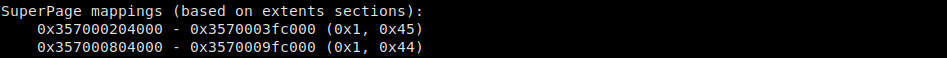
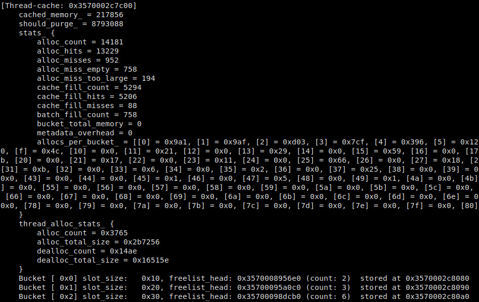
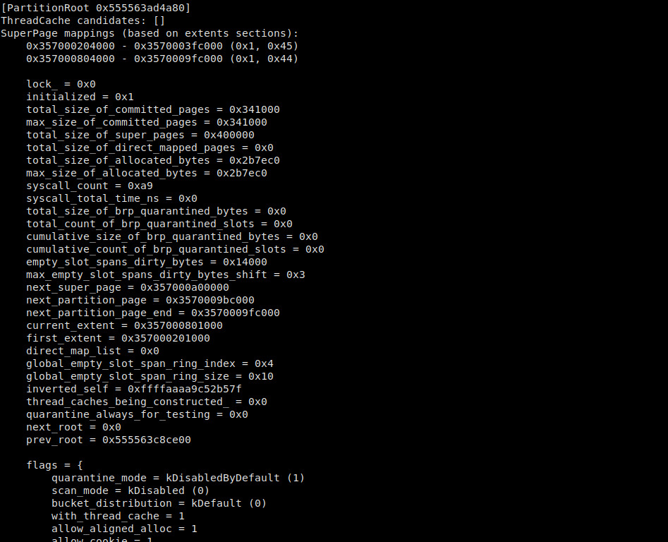
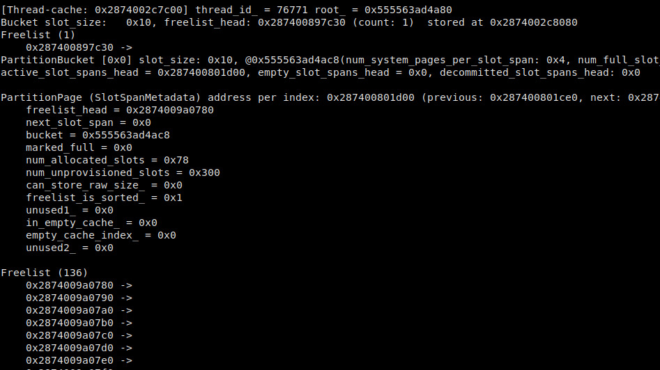
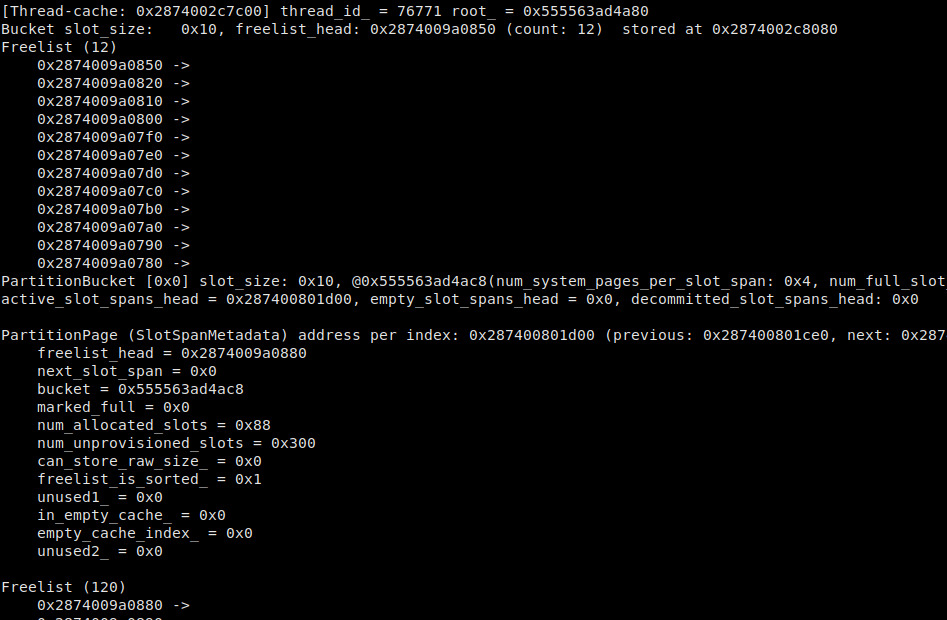
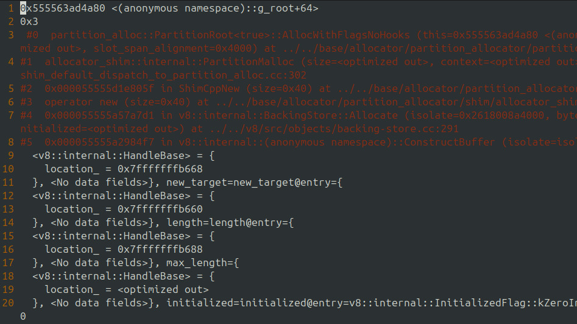
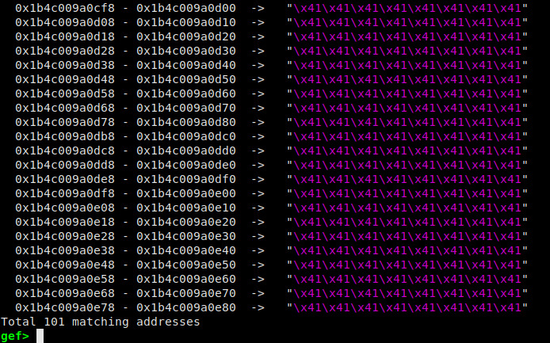
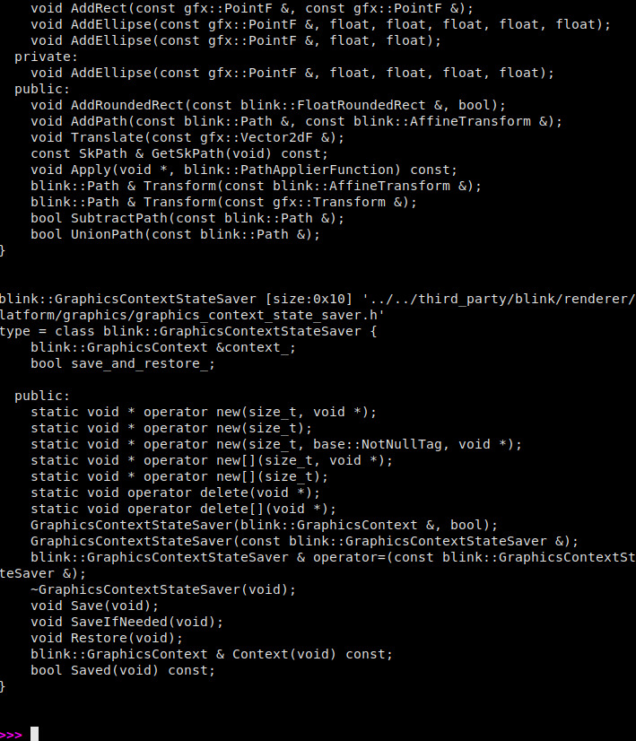

## Index

 - [What Is This?](#what-is-this)
 - [Setup](#setup)
 - [Commands](#commands)


<br/>

----

## What is this?

Inspect PartitionAlloc memory status. Based on chrome 113.

<br/>

----

## Setup

 - From gdb console: `source /<path>/PartitionAlloc_gdb/superpage_utils.py`

 - The following script can be used to test its functionality

```
gdb_script=$PWD/PartitionAlloc_gdb/gdb_script.gdb

chrome --user-data-dir=/tmp/xxx11 --no-sandbox --disable-crash-reporter --disable-breakpad --disable-gpu --enable-logging=stderr --headless --remote-debugging-port=9222 --font-render-hinting=none --renderer-cmd-prefix="xterm -title renderer -fa Monospace -fs 11 -ls -xrm 'XTerm*selectToClipboard:true' -e pwndbg -x $gdb_script -q --args" http://127.0.0.1:8000/PartitionAlloc_gdb/test.html 

```

<br/>

----

## Commands

 - `pa_print_slot_span_info --super_page_list $super_page_addr`: inspect superpage list for that partitionroot
    - 

 - `pa_print_slot_span_info --root $super_page_addr --is_page --skip_tcache_search` : dump partitionroot
    - 

 - `pa_print_slot_span_info --tcache $super_page_addr --is_page`: dump thread cache info
    - 

 - `pa_print_slot_span_info --trace_thread_bucket $super_page_addr --slot_index 0`: show thread bucket stats per slot_index (this is usefull when you want to inspect if any chunk of memory was allocated by the code, you can use it before and after some code so you know which object address was allocated
 - `pa_print_slot_span_info --trace_partition_bucket $super_page_addr --slot_index 0`: show partitionBucket stats per slot_index
    - 
    - 

 - `pa_collect_address --thread 1 --log /tmp/pa_alloc.log --command "bt" ../../base/allocator/partition_allocator/partition_root.h:1922 this bucket_index`: trace PartitionAlloc allocation by using sw breakpoints
    - 

 - `pa_search $super_page_addr "41 41 41 41 41 41 41 41"`: Search object sprayed
    - 

 - `pa_search_object_size --blink --v8 0x10`: search objects allocated on the fastmalloc partition requesting a slot_size 0x10 chunk/object (it's imprecise, and some objects are missing from the list, like shared_ptr and audioarray)
    - 


